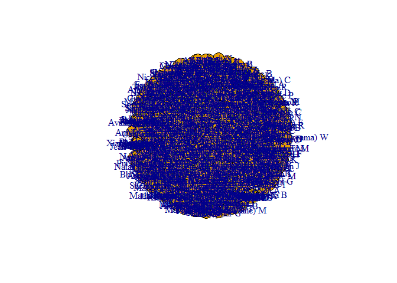
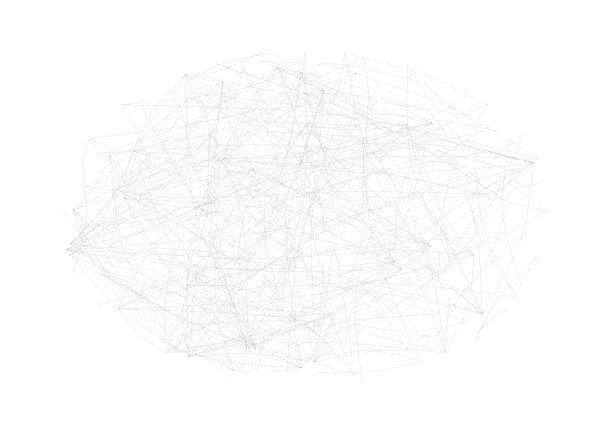

Excercise 1 - ORGB 672 - Hugo Garcia
================

In this Exercise, I analyze my own LinkedIn network, looking at
individuals and companies and how they interconnect.

# Setup

``` r
library(readr)
library(dplyr)
```

    ## 
    ## Attaching package: 'dplyr'

    ## The following objects are masked from 'package:stats':
    ## 
    ##     filter, lag

    ## The following objects are masked from 'package:base':
    ## 
    ##     intersect, setdiff, setequal, union

``` r
library(tidygraph)
```

    ## 
    ## Attaching package: 'tidygraph'

    ## The following object is masked from 'package:stats':
    ## 
    ##     filter

``` r
library(igraph)
```

    ## 
    ## Attaching package: 'igraph'

    ## The following object is masked from 'package:tidygraph':
    ## 
    ##     groups

    ## The following objects are masked from 'package:dplyr':
    ## 
    ##     as_data_frame, groups, union

    ## The following objects are masked from 'package:stats':
    ## 
    ##     decompose, spectrum

    ## The following object is masked from 'package:base':
    ## 
    ##     union

``` r
library(ggraph)
```

    ## Loading required package: ggplot2

``` r
connections=read.csv('Connections.csv')
```

# Preprocessing the Data

``` r
#Drop rows with empty First Name, Last Name, and Company.
# Note: I noticed there was a company named with just a blank " ", so I removed that one too.
df <- subset(connections, First.Name != "" & Last.Name != "" & Company !="" & Company !=" " )

# for each connection, keep first name + 1 letter of last name as a label
df$Last.Name <- substr(df$Last.Name, 1, 1)

# Create a new column "Full.Name" which has the first name in full, and the first letter of the last name
df$Full.Name <- paste(df$First.Name, df$Last.Name, sep = " ")

# Only keep Full Name and company
my_network <- select(df, Full.Name, Company)

#Create an ID column for each connection
my_network <- my_network %>% mutate(ID = row_number())
```

# Total count of contacts

``` r
# Get total count of contacts
total_count <- nrow(my_network)
cat("Total count of Contacts: ", total_count, "\n")
```

    ## Total count of Contacts:  587

# Count of Contacts by Employer

``` r
#Count number of employer and total count
company_counts <- my_network %>%
  group_by(Company) %>%
  summarize(total_count = n())%>%
  arrange(desc(total_count))
company_counts
```

    ## # A tibble: 468 × 2
    ##    Company                                             total_count
    ##    <chr>                                                     <int>
    ##  1 Deloitte                                                     12
    ##  2 McGill University - Desautels Faculty of Management          11
    ##  3 McGill University                                             9
    ##  4 BDC                                                           8
    ##  5 TD                                                            6
    ##  6 EY                                                            5
    ##  7 BRP                                                           4
    ##  8 CAE                                                           4
    ##  9 Caisse de dépôt et placement du Québec (CDPQ)                 4
    ## 10 KPI Digital Solutions                                         4
    ## # … with 458 more rows

# Creating Nodes & Edges

``` r
# Create nodes data frame
nodes <- data.frame(name = unique(my_network$Full.Name))

# Create edges data frame
edges <- my_network %>%
  inner_join(my_network, by = "Company", multiple="all") %>%
  filter(Full.Name.x != Full.Name.y) %>%
  select(from = Full.Name.x, to = Full.Name.y)
```

# Optional: PLotting the Resulting Network

``` r
# Create a graph object
graph_1 <- graph_from_data_frame(edges, vertices = nodes)

# Plot the graph
plot(graph_1, vertex.Full.Name = V(graph_1)$Full.Name)
```

<!-- -->

# Optional: PLotting the Resulting Network

``` r
# Create a tbl_graph object
graph_2 <- tbl_graph(nodes = nodes, edges = edges, directed = FALSE)

# Plot the graph
graph_2 %>%
   ggraph(layout = "kk") +
   geom_edge_arc(colour= "grey",
                 lineend = "round",
                 strength = .1,
                 alpha = .1) +
  theme_graph(background = "white") +
  guides(edge_width = FALSE,
         edge_alpha = FALSE, 
         scale = "none") 
```

    ## Warning: The `<scale>` argument of `guides()` cannot be `FALSE`. Use "none" instead as
    ## of ggplot2 3.3.4.

    ## Warning: Using the `size` aesthetic in this geom was deprecated in ggplot2 3.4.0.
    ## ℹ Please use `linewidth` in the `default_aes` field and elsewhere instead.

<!-- -->

# The resulting graphs are not clear to read and do not provide useful information. More effort is needed to create a clearer network graph of my LinkedIn connections.
