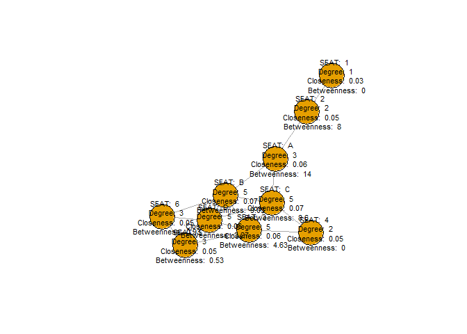

Exercise 2 - Bus Seat Network
================
Hugo Garcia (260791363)

## Project Scope

In this assignment, we plotted a network graph and calculated centrality
measures to determine which is the best seat to choose when riding the
scheduled company bus every morning. The objective is to develop
informal connections with coworkers by choosing the “best” seat to
fulfill this objective.

When you get onto the bus, some seats are occupied (1-6) and some are
open (A-D), as shown on the picture (see file ‘bus\_diagram.png’). You
can pick any one of the open seats, and the rest of them will fill up as
the bus goes along the route.

It takes many rides together to develop an informal connection, so you
should pick one seat and take it consistently. You notice that
communication is really possible with adjacent seats only, but any type
of adjacency works: side, front, back, diagonal, even across the aisle.
So, for example 4 can talk to 3 and C, but not to D or 5. Similarly, 6
can only talk to B, D or 5, but not to A (too far).

## Load the igraph Package

``` r
library(igraph)
```

    ## 
    ## Attaching package: 'igraph'

    ## The following objects are masked from 'package:stats':
    ## 
    ##     decompose, spectrum

    ## The following object is masked from 'package:base':
    ## 
    ##     union

## Create Nodes and Edges - NOTE: This is a non-directional network

``` r
network <- graph(edges=c("A","B",
                         "A","C",
                         "A","2",
                         "B","D",
                         "B","3",
                         "B","C",
                         "B","6",
                         "C","D",
                         "C","3",
                         "C","4",
                         "D","5",
                         "D","3",
                         "D","6",
                         "1","2",
                         "3","4",
                         "3","5",
                         "5","6"), 
                 directed = FALSE)
network
```

    ## IGRAPH 704b6ca UN-- 10 17 -- 
    ## + attr: name (v/c)
    ## + edges from 704b6ca (vertex names):
    ##  [1] A--B A--C A--2 B--D B--3 B--C B--6 C--D C--3 C--4 D--5 D--3 D--6 2--1 3--4
    ## [16] 3--5 6--5

## Calculate Degree Centrality for Each Node

``` r
degree_centrality <- degree(network, mode="all")
degree_centrality
```

    ## A B C 2 D 3 6 4 5 1 
    ## 3 5 5 2 5 5 3 2 3 1

## Calculate distances for Each Node

``` r
distances(network, mode="all")
```

    ##   A B C 2 D 3 6 4 5 1
    ## A 0 1 1 1 2 2 2 2 3 2
    ## B 1 0 1 2 1 1 1 2 2 3
    ## C 1 1 0 2 1 1 2 1 2 3
    ## 2 1 2 2 0 3 3 3 3 4 1
    ## D 2 1 1 3 0 1 1 2 1 4
    ## 3 2 1 1 3 1 0 2 1 1 4
    ## 6 2 1 2 3 1 2 0 3 1 4
    ## 4 2 2 1 3 2 1 3 0 2 4
    ## 5 3 2 2 4 1 1 1 2 0 5
    ## 1 2 3 3 1 4 4 4 4 5 0

## Calculate Closeness Centrality for each node

``` r
closeness_centrality <- closeness(network, mode = "all")
closeness_centrality
```

    ##          A          B          C          2          D          3          6 
    ## 0.06250000 0.07142857 0.07142857 0.04545455 0.06250000 0.06250000 0.05263158 
    ##          4          5          1 
    ## 0.05000000 0.04761905 0.03333333

## Calculate Betweenness Centrality for each node

``` r
betweenness_centrality <- betweenness(network, directed = FALSE)
betweenness_centrality
```

    ##          A          B          C          2          D          3          6 
    ## 14.0000000  9.0333333  8.6000000  8.0000000  3.2666667  4.6333333  0.9333333 
    ##          4          5          1 
    ##  0.0000000  0.5333333  0.0000000

## Calculate the Articulation Point (A.K.A. Cut Point) to see who, if anyone, is holding the entire network together

``` r
articulation.points(network)
```

    ## + 2/10 vertices, named, from 704b6ca:
    ## [1] 2 A

# Plot the Network Graph

``` r
# Add centrality scores as node attributes
V(network)$degree_centrality <- degree_centrality
V(network)$closeness_centrality <- closeness_centrality
V(network)$betweenness_centrality <- betweenness_centrality

# Set the vertex label as the combination of node attributes
V(network)$label <- paste(
  "\nSEAT: ", V(network)$name, "\n",
  "Degree: ", V(network)$degree_centrality, "\n",
  "Closeness: ", round(V(network)$closeness_centrality, 2), "\n",
  "Betweenness: ", round(V(network)$betweenness_centrality, 2))

layout <- layout_with_fr(network)

# Plot the Network Graph with node attributes as labels and custom layout
plot(network, vertex.size=30, vertex.label.cex=0.7,
     vertex.label.color="black", vertex.label.dist=1,
     vertex.label.family="sans", vertex.label.font=0.6,
     layout=layout)
```

<!-- -->

## Choosinig the “best” Seat on the Bus

Based on this analysis, I believe the best seat to choose is SEAT A.

## Discussion

Benefits of choosing SEAT A: Based on the connected components in the
network graph, choosing SEAT A would put me in a strategic position to
connect the entire network and become an appreciated and indispensable
new member in the network, and ultimately company.

Possible consequences choosing SEAT A: If I enter the bus and sit in
SEAT A, given that SEATS B, D, and C are free, I would only have the
person in SEAT 2 to link with, and thus have to wait until the next
people enter the bus to create the other links/edges with other
nodes/members in the network. In addition to this, choosing SEAT A,
instead of to SEAT D, might make me come across as anti-social because I
would be isolating myself from the already taken seats (nodes) like SEAT
3, 5, and 6.
